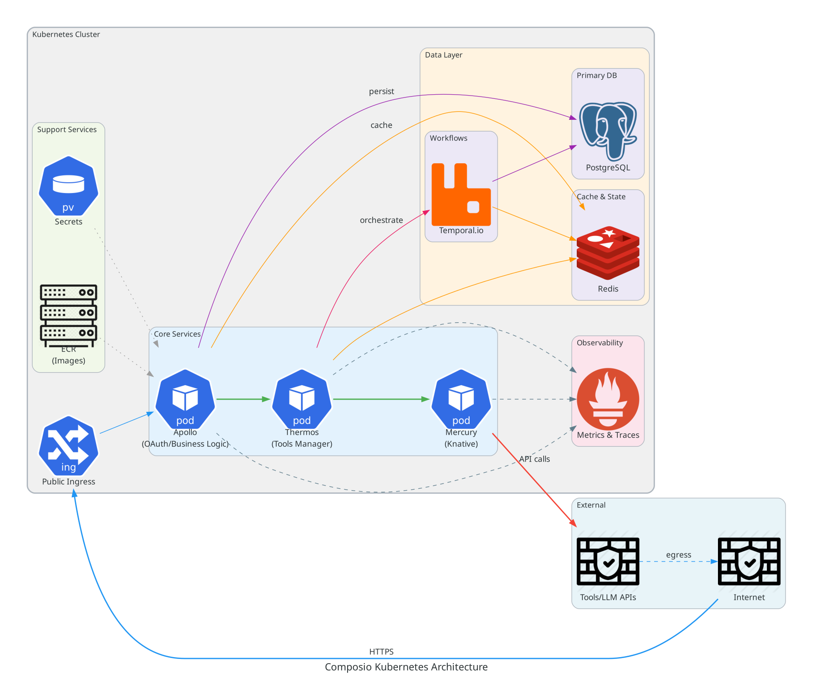

[](https://helm.sh/)
[](https://composiohq.github.io/helm-charts/index.html)

# Composio Helm Charts

[Complete Documentation](https://composiohq.github.io/helm-charts/)

Production-ready Helm charts to deploy Composio on any Kubernetes cluster.

If you need to see the architecture diagram, check `docs/architecture/composio_architecture.png`.

## Architecture 



## Installation

For installation instructions, please see the [Installation Guide](./docs/installation/index.md)

## Post-Installation

For post-installation steps, please see the [Post-Installation Guide](./docs/post-installation/index.md).

## 🔄 Upgradation

For upgradation steps, please see the [Upgradation Guide](./docs/upgradation/index.md).

## 📚 Documentation

- **Documentation Website**: https://composiohq.github.io/helm-charts/index.html
- **Architecture Guide**: https://composiohq.github.io/helm-charts/docs/architecture/composio_architecture.png
- **Configuration Reference**: https://composiohq.github.io/helm-charts/configuration.html
- **Cloud Provider Guides**: https://composiohq.github.io/helm-charts/guides.html
- **Troubleshooting**: https://composiohq.github.io/helm-charts/troubleshooting.html
- **GCS via S3 Storage Guide**: [docs/gcs-s3-storage.md](./docs/gcs-s3-storage.md)
 - **SMTP Setup Guide**: [docs/smtp-setup.md](./docs/smtp-setup.md)
 - **Frontend Setup Guide**: [docs/frontend-setup.md](./docs/frontend-setup.md)
- **Composio Docs**: https://docs.composio.dev
- **GitHub**: https://github.com/composio/helm-charts
- **Helm repo**: https://composiohq.github.io/helm-charts/ 

### Uninstall Composio

```bash
# Uninstall Helm release
helm uninstall composio -n composio
# Delete namespace (optional). This will also delete the secrets with decrypts the database
kubectl delete namespace composio
```
