# Composio Kubernetes Architecture

This diagram illustrates the architecture of Composio deployed on Kubernetes, showing the flow of requests, interactions between services, and auxiliary components.

## Architecture Overview

```mermaid
graph TB
    Internet[🌐 Internet] --> HTTPS[HTTPS]
    HTTPS --> PublicIngress[Public Ingress<br/>Optional]
    
    subgraph "KUBERNETES CLUSTER"
        PublicIngress --> Apollo[Apollo<br/>OAuth callbacks/business logic]
        
        Apollo <--> Redis[Redis<br/>Cache/Data Store]
        Apollo --> Thermos[Thermos<br/>Tools Management]
        
        Redis --> Temporal[Temporal.io<br/>Workflows Management]
        Thermos --> Temporal
        Thermos --> Mercury[Mercury<br/>Knative Service]
        
        Temporal <--> Postgres[Postgres<br/>Primary Database]
        Apollo <--> Postgres
        
        Mercury --> ToolsAPIs[Tools/LLM APIs<br/>External Services]
        
        subgraph "AUXILIARY SERVICES"
            KubeSecrets[kube-secrets<br/>Secret Management]
            OtherK8s[Other Necessary K8s<br/>Components]
            ECR[ECR<br/>Docker Images]
        end
        
        Apollo --> OtelCollector[Otel Collector<br/>Metrics/Traces]
        Thermos --> OtelCollector
        Mercury --> OtelCollector
    end
    
    ToolsAPIs -.->|Outbound Actions<br/>egress internet| Internet
    
    classDef coreService fill:#e1f5fe,stroke:#01579b,stroke-width:2px
    classDef database fill:#f3e5f5,stroke:#4a148c,stroke-width:2px
    classDef external fill:#fff3e0,stroke:#e65100,stroke-width:2px
    classDef auxiliary fill:#e8f5e8,stroke:#1b5e20,stroke-width:2px
    classDef monitoring fill:#fce4ec,stroke:#880e4f,stroke-width:2px
    
    class Apollo,Thermos,Mercury coreService
    class Redis,Postgres,Temporal database
    class Internet,ToolsAPIs external
    class KubeSecrets,OtherK8s,ECR auxiliary
    class OtelCollector monitoring
```

## Component Descriptions

### Core Services
- **Apollo**: Main API service handling OAuth callbacks and business logic
- **Thermos**: Tools management service for external integrations
- **Mercury**: Knative-based service for outbound actions to external APIs

### Data Layer
- **Redis**: Caching and session storage
- **Postgres**: Primary database for persistent data
- **Temporal.io**: Workflow orchestration and management (only required if auth refresh and/or triggers are enabled)

### External Integration
- **Tools/LLM APIs**: External services and APIs for AI functionality
- **Public Ingress**: Optional entry point for external access

### Auxiliary Services
- **kube-secrets**: Kubernetes secret management
- **ECR**: Container registry for Docker images
- **Other K8s**: Additional Kubernetes components

### Monitoring
- **Otel Collector**: Observability and telemetry data collection

## Request Flow

1. **Incoming Requests**: HTTPS requests from the Internet through Public Ingress
2. **Authentication**: Apollo handles OAuth callbacks and business logic
3. **Tool Management**: Thermos manages external tool integrations
4. **Workflow Processing**: Temporal.io orchestrates complex workflows (only used when auth refresh and/or triggers are enabled)
5. **External Actions**: Mercury executes outbound calls to external APIs
6. **Data Persistence**: All services interact with Redis and Postgres for data storage
7. **Monitoring**: Otel Collector gathers metrics and traces from all services
